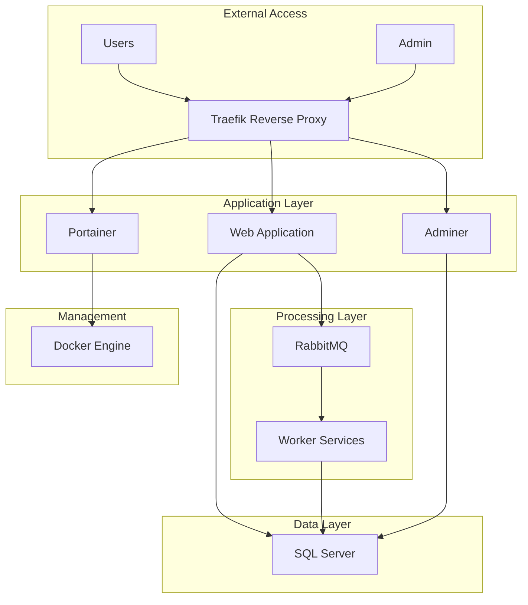

# 🤖 Digital Bot

[](https://dotnet.microsoft.com/)
[](https://asp.net/)
[](https://docker.com/)
[](https://rabbitmq.com/)
[](https://www.microsoft.com/sql-server)
[](https://traefik.io/)

A comprehensive ASP.NET Core web application with microservices architecture, featuring message queuing, database management, and containerized deployment with automatic SSL certificates.

## 🌟 Features

- **Microservices Architecture**: Scalable and maintainable service-oriented design
- **Message Queue Processing**: RabbitMQ integration for reliable message handling
- **Automatic SSL**: Let's Encrypt integration via Traefik
- **Database Management**: SQL Server with Adminer interface
- **Container Orchestration**: Docker Compose for easy deployment
- **Monitoring**: Portainer for container management
- **Worker Scaling**: Configurable worker replicas
- **Health Checks**: Built-in health monitoring

## 🏗️ Architecture



## 🚀 Quick Start

### Prerequisites

- [Docker](https://docs.docker.com/get-docker/) & [Docker Compose](https://docs.docker.com/compose/install/)
- [Git](https://git-scm.com/)
- Domain name (for SSL certificates)

### Installation

1. **Clone the repository**
   ```bash
   git clone https://github.com/H0sin/digital_bot_installer.git
   cd digital_bot_installer
   ```

2. **Configure environment variables**
   ```bash
   cp .env.example .env
   ```

3. **Update the `.env` file** with your configuration:
   ```bash
   nano .env
   ```

4. **Start the application**
   ```bash
   docker-compose up -d
   ```

5. **Access the application**
   - Main App: `https://your-domain.com`
   - Database Admin: `https://dbadmin.your-domain.com`
   - Container Management: `https://monitor.your-domain.com`

## ⚙️ Configuration

### Environment Variables

Create a `.env` file in the project root:

```env
# --- Docker Compose Settings ---
COMPOSE_PROJECT_NAME=digitalbot

# --- Image Settings ---
WEBAPP_IMAGE=ghcr.io/H0sin/digital_bot_installer:latest
WORKER_IMAGE=ghcr.io/H0sin/digital_bot_installer-worker:latest
WORKER_REPLICAS=5 

# --- Database Settings ---
DB_USER=sa
DB_PASSWORD=YourStrongPassword123!
DB_NAME=DigitalBot_DB

# --- Domain Settings ---
DOMAIN=your-domain.com
DB_ADMIN_DOMAIN=dbadmin.your-domain.com
PORTAINER_DOMAIN=monitor.your-domain.com
ACME_EMAIL=your-email@example.com

# --- RabbitMQ Settings ---
RABBITMQ_USER=admin
RABBITMQ_PASS=your-rabbitmq-password
```

### Configuration Reference

| Variable | Description | Required | Default |
|----------|-------------|----------|----------|
| `COMPOSE_PROJECT_NAME` | Docker Compose project name | ✅ | `digitalbot` |
| `WEBAPP_IMAGE` | Web application Docker image | ✅ | - |
| `WORKER_IMAGE` | Worker service Docker image | ✅ | - |
| `WORKER_REPLICAS` | Number of worker instances | ❌ | `1` |
| `DB_PASSWORD` | Database SA password | ✅ | - |
| `DB_NAME` | Database name | ✅ | - |
| `DOMAIN` | Main application domain | ✅ | - |
| `DB_ADMIN_DOMAIN` | Database admin subdomain | ✅ | - |
| `PORTAINER_DOMAIN` | Container management subdomain | ✅ | - |
| `ACME_EMAIL` | Email for SSL certificates | ✅ | - |
| `RABBITMQ_USER` | RabbitMQ username | ✅ | - |
| `RABBITMQ_PASS` | RabbitMQ password | ✅ | - |

## 🏃‍♂️ Development

### Project Structure

```
digital_bot_installer/
├── traefik/                    # Traefik reverse proxy configuration
│   └── dynamic/               # Dynamic configuration files
│       ├── middlewares.yml    # Security and rate limiting
│       └── services.yml       # Custom service definitions
├── certs/                     # SSL certificate storage
├── docker-compose.yml         # Main Docker services configuration
├── .env                       # Environment variables
├── .env.example              # Environment template
├── start-with-traefik.sh     # Main startup script
├── migrate-to-traefik.sh     # HAProxy to Traefik migration
├── fix-521-error.sh          # Cloudflare 521 error fixes
├── troubleshoot-521.sh       # Comprehensive diagnostics
├── TRAEFIK-ADVANCED.md       # Advanced Traefik configuration
├── TRAEFIK-FIX-NETWORK-MIDDLEWARE.md # Network troubleshooting
├── .gitignore                # Git ignore rules
└── README.md                 # This file
```

### Local Development

1. **Start infrastructure services**
   ```bash
   docker-compose up -d db rabbitmq
   ```

2. **Run the application locally**
   ```bash
   dotnet run --project Api
   ```

3. **Run worker service**
   ```bash
   dotnet run --project Worker
   ```

### Building Docker Images

```bash
# Build web application
docker build -t your-registry/digital_bot_installer:latest -f Api/Dockerfile .

# Build worker service
docker build -t your-registry/digital_bot_installer-worker:latest -f Worker/Dockerfile .
```

## 🔧 Services Overview

### Web Application (API)
- **Port**: 8080 (internal)
- **Framework**: ASP.NET Core 9.0
- **Features**: RESTful API, Authentication, Authorization

### Worker Service
- **Replicas**: Configurable (default: 1)
- **Purpose**: Background task processing
- **Queue**: RabbitMQ integration

### Database (SQL Server)
- **Version**: 2022 Latest
- **Port**: 1433 (internal)
- **Features**: Health checks, persistent storage

### Message Queue (RabbitMQ)
- **Version**: 3.13 with Management
- **Ports**: 5672 (AMQP), 15672 (Management)
- **Features**: Message persistence, management UI

### Reverse Proxy & Load Balancer (Traefik)
- **Version**: v3.0
- **Ports**: 80 (HTTP), 443 (HTTPS), 8080 (Dashboard)
- **Features**: 
  - Automatic SSL with Let's Encrypt (HTTP-01 & DNS-01)
  - Dynamic service discovery
  - Load balancing with health checks
  - Rate limiting and security headers
  - Prometheus metrics
  - Hot reload without downtime

## 📊 Monitoring & Management

### Service Health Monitoring

```bash
# Check all services status
docker-compose ps

# View service logs
docker-compose logs -f [service-name]

# Monitor resource usage
docker stats
```

### RabbitMQ Management
- **URL**: `http://your-server-ip:15672`
- **Credentials**: Use `RABBITMQ_USER` and `RABBITMQ_PASS`

### Database Management
- **URL**: `https://dbadmin.your-domain.com`
- **Server**: `db`
- **Credentials**: Use `DB_USER` and `DB_PASSWORD`

### Container Management
- **URL**: `https://monitor.your-domain.com`
- **Features**: Container monitoring, log viewing, resource management

## 🚀 Deployment

### Production Deployment

1. **Prepare the server**
   ```bash
   # Update system
   sudo apt update && sudo apt upgrade -y

   # Install Docker
   curl -fsSL https://get.docker.com -o get-docker.sh
   sudo sh get-docker.sh

   # Install Docker Compose
   sudo curl -L "https://github.com/docker/compose/releases/download/v2.21.0/docker-compose-$(uname -s)-$(uname -m)" -o /usr/local/bin/docker-compose
   sudo chmod +x /usr/local/bin/docker-compose
   ```

2. **Configure DNS**
   - Point your domain to your server IP
   - Configure subdomains for admin interfaces

3. **Deploy application**
   ```bash
   git clone https://github.com/H0sin/digital_bot_installer.git
   cd digital_bot_installer
   cp .env.example .env
   # Edit .env with your configuration
   docker-compose up -d
   ```

### Scaling Workers

```bash
# Scale to 10 workers
docker-compose up -d --scale worker=10

# Or update WORKER_REPLICAS in .env and restart
docker-compose up -d
```

### SSL Certificate Management

Traefik automatically manages SSL certificates through Let's Encrypt. Ensure:
- Your domains point to your server
- Ports 80 and 443 are accessible
- Email in `ACME_EMAIL` is valid

## 🚀 Deployment

### Quick Start

1. **Clone and configure**:
```bash
git clone https://github.com/H0sin/digi_installer.git
cd digi_installer
cp .env.example .env  # Edit with your settings
```

2. **Start services**:
```bash
# Start entire stack with Traefik (default)
docker compose up -d

# Monitor startup
docker compose logs -f traefik
```

3. **Access your services**:
- App: https://DOMAIN
- Client: https://CLIENT_APP_DOMAIN
- RabbitMQ: https://RABBITMQ_DOMAIN
- pgAdmin: https://PGADMIN_DOMAIN
- Portainer: https://PORTAINER_DOMAIN
- RedisInsight: https://REDISINSIGHT_DOMAIN
- Traefik Dashboard: https://TRAEFIK_DOMAIN

### 🔄 Migrating from HAProxy

If you have an existing HAProxy setup, use the automated migration script:

```bash
# Automated migration with backup
./migrate-to-traefik.sh

# Manual migration (if preferred)
docker compose stop haproxy
docker compose up -d
```

### 🚨 Fixing Cloudflare 521 Errors

If you encounter "Web server is down" errors after migration:

```bash
# Quick fix for 521 errors
./fix-521-error.sh

# Comprehensive diagnostics
./troubleshoot-521.sh
```

**Common causes and solutions:**
- **No service on ports 80/443**: Ensure Traefik is running (`docker compose ps traefik`)
- **Container crashes (Exit 139)**: Check memory limits and architecture compatibility
- **DNS/SSL issues**: For HTTP-01 challenge, temporarily use "DNS-only" in Cloudflare
- **Firewall blocking**: Ensure UFW allows ports 80 and 443 (`sudo ufw allow 80,443/tcp`)

### 🔧 Configuration

Ensure DNS A/AAAA records point to your server for all domains listed in `.env`:
- Main domains: `DOMAIN`, `CLIENT_APP_DOMAIN`
- Admin interfaces: `RABBITMQ_DOMAIN`, `PGADMIN_DOMAIN`, `PORTAINER_DOMAIN`, `REDISINSIGHT_DOMAIN`
- Optional Traefik dashboard: `TRAEFIK_DOMAIN`

### 🔒 SSL Certificate Management

Traefik automatically manages SSL certificates through Let's Encrypt with two challenge methods:

#### HTTP-01 Challenge (Default)
- Suitable for most setups
- Requires ports 80 and 443 to be publicly accessible
- Issues individual certificates per domain

#### DNS-01 Challenge (For Wildcards)
- Enables wildcard certificates (`*.yourdomain.com`)
- Requires DNS provider API access (e.g., Cloudflare)
- Set `TRAEFIK_CERT_RESOLVER=dnsresolver` and configure `CLOUDFLARE_API_TOKEN`

### 🛡️ Security Features

- **Automatic HTTPS**: HTTP to HTTPS redirect with HSTS headers
- **Rate Limiting**: Configurable per-service rate limits
- **Security Headers**: XSS protection, content sniffing prevention, etc.
- **TLS Hardening**: TLS 1.2+ with secure cipher suites
- **Optional Basic Auth**: Protect admin interfaces and dashboard

### 📊 Monitoring & Observability

- **Structured Logs**: JSON format for easy parsing
- **Prometheus Metrics**: Built-in metrics endpoint
- **Health Checks**: Service health monitoring
- **Dashboard**: Web UI at `https://TRAEFIK_DOMAIN` (optional)

### 🔧 Adding New Services

To add a new service with automatic SSL and routing:

```yaml
new-service:
  image: your-service:latest
  networks:
    - web
  labels:
    - traefik.enable=true
    - traefik.http.routers.newservice.rule=Host(`new.yourdomain.com`)
    - traefik.http.routers.newservice.entrypoints=websecure
    - traefik.http.routers.newservice.tls=true
    - traefik.http.routers.newservice.tls.certresolver=httpresolver
    - traefik.http.routers.newservice.middlewares=default-security@file,rate-limit@file
    - traefik.http.services.newservice.loadbalancer.server.port=8080
```

### 📈 Scaling Workers

```bash
# Scale background processors
docker compose up -d --scale processor=10

# Scale order workers
docker compose up -d --scale order-worker=5

# Or update replicas in .env and restart
docker compose up -d
```

## 🛠️ Troubleshooting

### Common Issues

### Common Issues

<details>
<summary>🚨 Cloudflare 521 "Web server is down" Error</summary>

**Quick Fix:**
```bash
./fix-521-error.sh
```

**Common causes:**
- Traefik not running or crashed
- Ports 80/443 not bound or blocked by firewall
- Container crashes (especially Exit 139 - segmentation fault)
- DNS not pointing to server IP

**Troubleshooting steps:**
1. Check if Traefik is running: `docker compose ps traefik`
2. Verify ports are listening: `netstat -tulpn | grep -E ":80|:443"`
3. Check for crashed containers: `docker compose ps -a | grep Exit`
4. Review Traefik logs: `docker compose logs traefik`
5. Run comprehensive diagnostics: `./troubleshoot-521.sh`

**For Cloudflare users:**
- HTTP-01 challenge: Temporarily set DNS to "DNS-only" (gray cloud)
- Wait for certificate issuance, then re-enable "Proxied" (orange cloud)
- DNS-01 challenge: Set `TRAEFIK_CERT_RESOLVER=dnsresolver` and configure API token
</details>

<details>
<summary>SSL Certificate Issues</summary>

- Check domain DNS settings point to your server
- Verify `TRAEFIK_ACME_EMAIL` is valid
- Check Traefik logs: `docker compose logs traefik`
- Ensure ports 80 and 443 are open and accessible
- For DNS-01: Verify DNS provider credentials (e.g., `CLOUDFLARE_API_TOKEN`)
- Check ACME storage: `docker volume inspect ${COMPOSE_PROJECT_NAME}_traefik-letsencrypt`
</details>

<details>
<summary>Service Routing Issues</summary>

- Verify service has `traefik.enable=true` label
- Check router rules in service labels
- Ensure service is on the `web` network
- Check Traefik dashboard for service discovery
- Verify DNS resolution: `nslookup yourdomain.com`
</details>

<details>
<summary>Database Connection Issues</summary>

- Verify `POSTGRES_PASSWORD` is correct
- Check database health: `docker compose exec postgres pg_isready -U ${POSTGRES_USER}`
- Review connection strings in application logs
- Ensure services are on the `internal` network
</details>

<details>
<summary>RabbitMQ Connection Issues</summary>

- Check RabbitMQ service status: `docker compose logs rabbitmq`
- Verify credentials in `.env`
- Test management UI access at `https://${RABBITMQ_DOMAIN}`
- Check network connectivity between services
</details>

<details>
<summary>Traefik Dashboard Access</summary>

- Ensure `TRAEFIK_DOMAIN` DNS points to your server
- Check dashboard router configuration
- Verify basic auth credentials if configured
- Access logs: `docker compose logs traefik | grep dashboard`
</details>

### Useful Commands

```bash
# Check all services status
docker compose ps

# View Traefik configuration and routes
docker compose exec traefik traefik version
curl -s http://localhost:8080/api/http/routers | jq

# Restart specific service
docker compose restart [service-name]

# View real-time logs
docker compose logs -f --tail=100 [service-name]

# SSL certificate debugging
docker compose exec traefik ls -la /letsencrypt/
docker compose logs traefik | grep -i acme

# Clean up unused resources
docker system prune -a

# Backup certificates
docker cp traefik:/letsencrypt ./letsencrypt-backup

# Force certificate renewal (if needed)
docker compose exec traefik rm /letsencrypt/acme.json
docker compose restart traefik
```

## 📚 Technology Stack

- **Backend**: ASP.NET Core 9.0, C# 13.0
- **Database**: PostgreSQL 16 (Alpine)
- **Message Queue**: RabbitMQ 3.13 with Management
- **Reverse Proxy & Load Balancer**: Traefik v3.0
- **Caching**: Redis 7 (Alpine)
- **Containerization**: Docker & Docker Compose
- **SSL**: Let's Encrypt (automatic via Traefik)
- **Monitoring**: Portainer, pgAdmin, RedisInsight, Traefik Dashboard

## 🔒 Security

### Security Features

- **HTTPS Only**: Automatic redirect from HTTP to HTTPS
- **SSL Certificates**: Automatic Let's Encrypt certificates
- **Network Isolation**: Internal network for service communication
- **Database Security**: Database only accessible from internal network
- **Container Security**: Non-root user containers where possible

### Security Best Practices

1. **Use strong passwords** for all services
2. **Regularly update** Docker images
3. **Monitor logs** for suspicious activity
4. **Backup data** regularly
5. **Keep SSL certificates** up to date

## 🤝 Contributing

We welcome contributions! Please follow these steps:

1. **Fork the repository**
2. **Create a feature branch**
   ```bash
   git checkout -b feature/amazing-feature
   ```
3. **Make your changes**
4. **Add tests** if applicable
5. **Commit your changes**
   ```bash
   git commit -m 'Add amazing feature'
   ```
6. **Push to the branch**
   ```bash
   git push origin feature/amazing-feature
   ```
7. **Open a Pull Request**

### Development Guidelines

- Follow C# coding standards
- Write meaningful commit messages
- Add documentation for new features
- Ensure all tests pass
- Update README if needed

## 📊 Performance

### Recommended Resources

| Component | Minimum | Recommended |
|-----------|---------|-------------|
| CPU | 2 cores | 4+ cores |
| RAM | 4GB | 8GB+ |
| Storage | 20GB | 50GB+ |
| Network | 100Mbps | 1Gbps |

### Performance Monitoring

```bash
# Monitor resource usage
docker stats

# Check database performance
docker exec digitalbot-db /opt/mssql-tools18/bin/sqlcmd -S localhost -U sa -P "password" -Q "SELECT * FROM sys.dm_os_performance_counters WHERE counter_name LIKE '%CPU%'"

# Monitor RabbitMQ queues
curl -u admin:password http://localhost:15672/api/queues
```

## 📄 License

This project is licensed under the MIT License - see the [LICENSE](LICENSE) file for details.

## 🙏 Acknowledgments

- [ASP.NET Core](https://asp.net/) team for the amazing framework
- [RabbitMQ](https://rabbitmq.com/) for reliable messaging
- [Traefik](https://traefik.io/) for automatic SSL and load balancing
- [Docker](https://docker.com/) for containerization

## 📞 Support

- **Issues**: [GitHub Issues](https://github.com/H0sin/digital_bot_installer/issues)
- **Discussions**: [GitHub Discussions](https://github.com/H0sin/digital_bot_installer/discussions)
- **Email**: support@your-domain.com

---

<p align="center">
  Made with ❤️ by the Digital Bot Team
</p>
